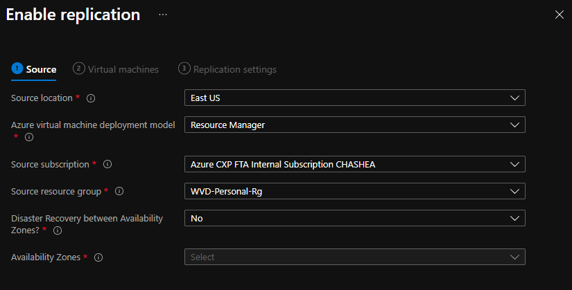
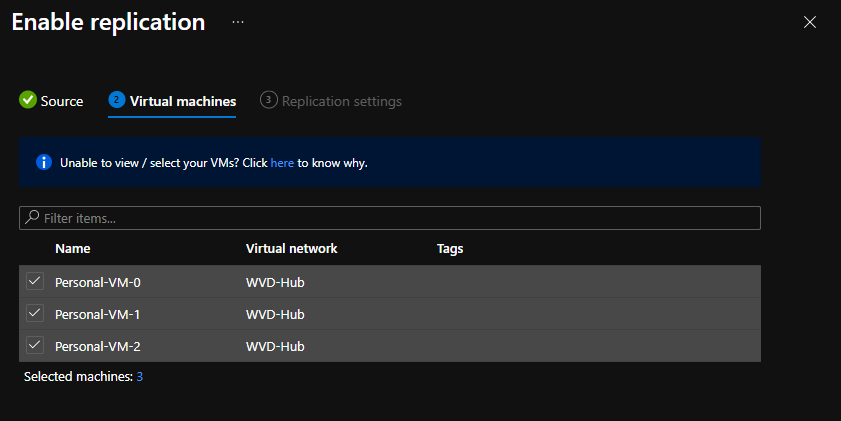
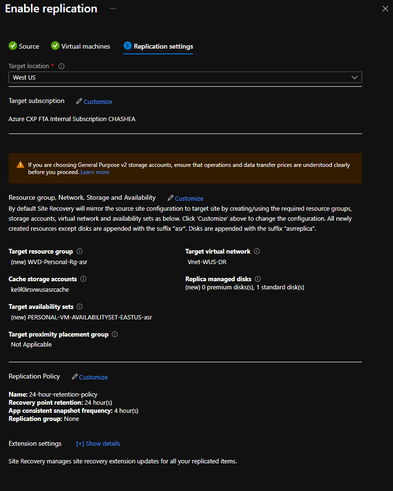
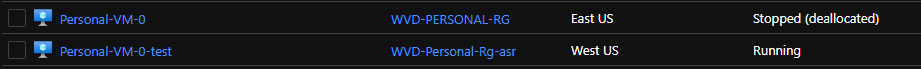
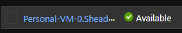

# BCDR for Personal HostPools

## Disaster Recovery for Personal HostPools

### Introduction

To prepare for an Azure outage, you want to make sure your WVD VMs are replicating to a secondary region. With Azure Recovery Services Vault you can replicate your data to a designated secondary region. If your primary region goes down, you can go to your Recovery Services Vault to failover to your secondary region. 

There are some requirments that is needed for your VMs to work in a secondary site. Of course a Virtual Network, Subnets, and Availbilty Set will need to be available in the secondary region and they will need some kind of access to your Active Directory whether it's a Site to Site VPN to your on-prem or using Azure Active Directory Domain Services. 

**NOTE:** Azure Active Directory Domain Join is going to be available soon and could be the best option.

The best thing about setting up Disaster Recovery with Windows Virtual Desktop is you won't need to set up another HostPool, App Group and Workspaces. The availability for the meta data is controlled by Microsoft and is always available. When you replicate your data from primary to secondary region the computer name and the agent is being replicated as well. When your VM is up in the secondary region it will have a new VM name but the computer name will still be the same and the agent will still be associtated with your HostPool. 

### How to set it up
- Create a Recovery Services Vault in the secondary region you are failing over to (ie: East Us is Primary, West US is Secondary. RSV will be created in West US). 
- Create a Virtual Network with a Subnet for your WVD Machines and an Availability Set in your secondary region.  
- Make sure you have access to some kind of domain controller for your machines to join the domain when they are created. Add the IP Addresses of your DC to your DNS Server of your VNet. 

- Under Source:
   -  Location (Primary Region), 
   -  Deployment model always be Resource Manager. 
   -  Subscription and Resource Group where your WVD VMs are located. 
   -  Choose if you want to use Availibility Zones and what zone you want to select for those VMs.
 
    **NOTE:** For Availbility Zones to work successfully, I would suggest group some of your VMs and replicate to different Zones. ie: Five VMs to Zone 1, Five to Zone 2 and Five to Zone 3. 

- Under the Virtual Machine:
  - Select which VMs you want to replicate to the secondary location. 

 
- Under the Replication settings:
  - Select your Target Location and confirm your Target Subscription is correct
  - Select your Target VNet, Target Resource Grou, Target Availability Set. 
  - Choose which type of Disk you want to replicate too. 
  - Choose a storage account, new or exisiting, for your cache data before it is replicated. 
  - Proximity placement group is an option but you can leave as NA as you probably don't need it.
  - Replication Policy has default 24 hours RPO and 4 hour snap shot frequency as default. You can create your own policy if the defaul doesn't meet your needs.
  - Select whether you want to enable Multi-VM Consistency. 
  - When your settings are all correct click on Enable Replication.

- After replication is enabled:
   - Go to Replicated Items under RSV to see your VM/s. The syncronization process does take some time to completeMake sure the Replication Health is Healthy and there are no issues. 
   - Once the sync is completed you should see Test Failover as an option. This will simulate a failover without having to do a full failover and losing your VM. Your VM that you are replicating is still on. Once the Test Failover is complete turn off your primary VM and leave your failover VM on, you should see that your Session Host for that VM is still showing as Available. The Session Host will go Unavailable for 30 secs until the primary machine is completely off and then show Available. 
   - If you want to change some of the settings you can go into the replicated VM and change the Target settings under Compute and Network. 
- In the images below you can see I have my failover VM running and my primary VM turned off and my Session Host is still Active. 

**NOTE:** It does suggest using a seperate VNet for running Test Failover. The problem with that would be the testing Vnet won't have access to your domain controller, If you want to see the failover process than feel free to use a seperate testing VNet.

## Resources
- [Azure to Azure DR Architecture](https://docs.microsoft.com/en-us/azure/site-recovery/azure-to-azure-architecture)
- [Prepare netowkring for Azure VM DR](https://docs.microsoft.com/en-us/azure/site-recovery/azure-to-azure-about-networking)
- [Customize Networking Configurations for target VMs](https://docs.microsoft.com/en-us/azure/site-recovery/azure-to-azure-customize-networking)
- [Monitor Site Recovery](https://docs.microsoft.com/en-us/azure/site-recovery/site-recovery-monitor-and-troubleshoot)
- [Azure Academy - DR for WVD](https://www.youtube.com/watch?v=cTllLvZ6nw8)
