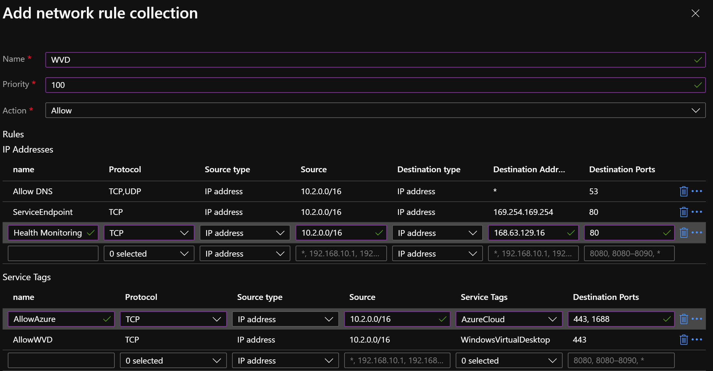
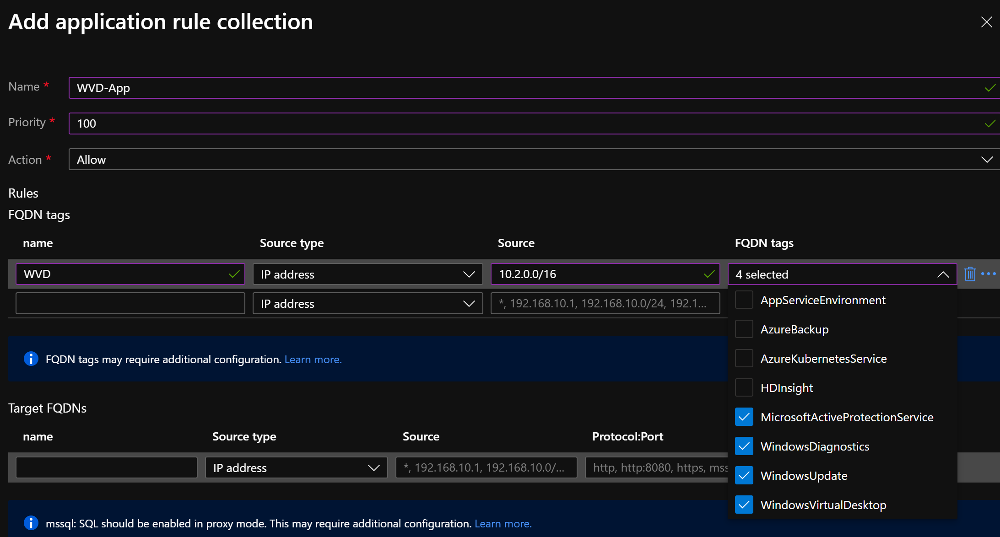

# Windows Virtual Desktop with Azure Firewall

### Overview
For this guide we will add the Required URLs needed for WVD to the Azure Firewall. Also, you will need tp set up User Defined Route to send the traffice from your WVD Subnets to your Azure Firewall.  

### Firewall Configuration
To configure the firewall, you will need to add firewall rules under the Network Rule Collection and App Rule Collection. 

#### Network Rule Collection
* Settings: 
    * Name: WVD
    * Priority: 100
    * Action: Allow

* IP Address
    * Rule 1
        * Name: Allow DNS
        * Protocol: TCP,UDP
        * Source Type: IP Address
        * Source: Is the IP Address space of your VNet for your WVD Session Host VMs
        * Destination Type: *
        * Destination Ports: 53
    * Rule 2
        * Name: ServiceEndpoint
        * Protocol: TCP
        * Source Type: IP address
        * Source: IP Address space of your VNet for WVD Session Host VMs
        * Destination type: IP Address
        * Destination Address: 169.254.169.254
        * Destination Ports: 80
    * Rule 3
        * Name: Health Monitoring
        * Protocol: TCP
        * Source Type: IP Address
        * Source: IP Address space of your VNet for WVD Session Host VMs
        * Destination Type: IP Address
        * Destination Address: 168.63.129.16
        * Destination Port: 80
        
* Service Tags
    * Rule 1
        * Name: Allow Azure
        * Protocol: TCP
        * Source Type: IP address
        * Source: The IP Address space of your VNet for your WVD Session Host VMs
        * Service Tags: AzureCloud
        * Destination Ports: 443, 1688
    * Rule 2
        * Name: Allow WVD
        * Protocol: TCP
        * Source Type: IP address
        * Source: The IP Address space of your VNet for your WVD Session Host VMs
        * Service Tags: WindowsVirtualDesktop
        * Destination Ports: 443

#### Application Rule Setting
* Settings: 
    * Name: WVD-AppRule-1
    * Priority: 
    * Action: Allow

* Rules
    * FQDN Tags
        * Name: WVD
        * Source Type: IP Address
        * Source: Is the IP Address space of your VNet for your WVD Session Host VMs
        * FQDN Tags: WindowsUpdate, WindowsDiagnostics, MicrosoftActivationProtection, WindowsVirtualDesktop

### UDR Configuration
* Create a new Route for WVD FW. 
    * Address Prefix: 0.0.0.0/0
    * Next hop type: Virtual Appliance
    * Next hop address: Private IP of your AzFW
* Associate Route with Subnet used for WVD Session Host VMs

### References
* [WVD Required URL List](https://docs.microsoft.com/en-us/azure/virtual-desktop/safe-url-list)
* [Deploy and Configure Azure Firewall](https://docs.microsoft.com/en-us/azure/firewall/tutorial-firewall-deploy-portal)
* [User Defined Routing](https://docs.microsoft.com/en-us/azure/virtual-network/virtual-networks-udr-overview#user-defined)
* [WVD Network Security - Azure Academy](https://www.youtube.com/watch?v=up90eL2Bbho&list=PL-V4YVm6AmwXGvQ46W8mHkpvm6S5IIitK&index=12)
