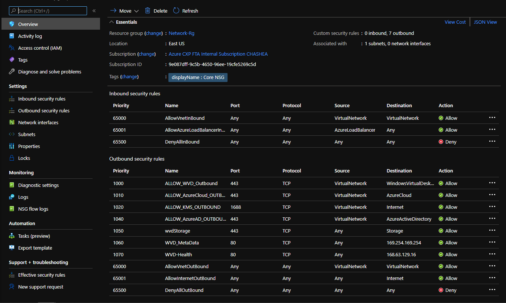

# Configuring Network Security Groups with WVD Required URLs

## Overview
Network Security Group can filter network traffic to and from your resources. In this case the NSG will be associated to the Subnet for your WVD Session Host VMs. A Basic NSG would be suffient enough for a Subnet and would not block any access to WVD required URLs. But if more of a secure NSG is needed you can added the Outbound rules to your NSG. See NSG Screen shot below as an example. 

## Network Security Group with WVD Required URLs

## Resources
* [WVD Required URL list](https://docs.microsoft.com/en-us/azure/virtual-desktop/safe-url-list)
* [NSG Overview](https://docs.microsoft.com/en-us/azure/virtual-network/network-security-groups-overview)
* [WVD Security - Azure Academy](https://www.youtube.com/watch?v=up90eL2Bbho&list=PL-V4YVm6AmwXGvQ46W8mHkpvm6S5IIitK&index=12)
